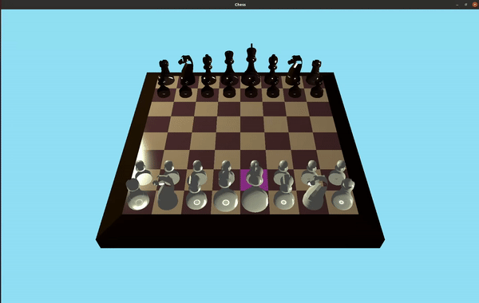

# 3D Chess
A 3D chess game in OpenGL created for the purposes of assessment for a computer graphics course.



## Requirements

Create a venv
```
python3 -m venv .venv
```
and source it then install dependencies with
```
pip install -e .
```

## Usage
Once the virtual environment run the game with
```
python Chess.py
```
in the outmost directory.

## Game Control
|Key|Action|
|:---:|:---:|
|`W`|Move cursor forward|
|`A`|Move cursor left|
|`S`|Move cursor backward|
|`D`|Move cursor right|
|`Space`|Select piece<br>Move piece|
