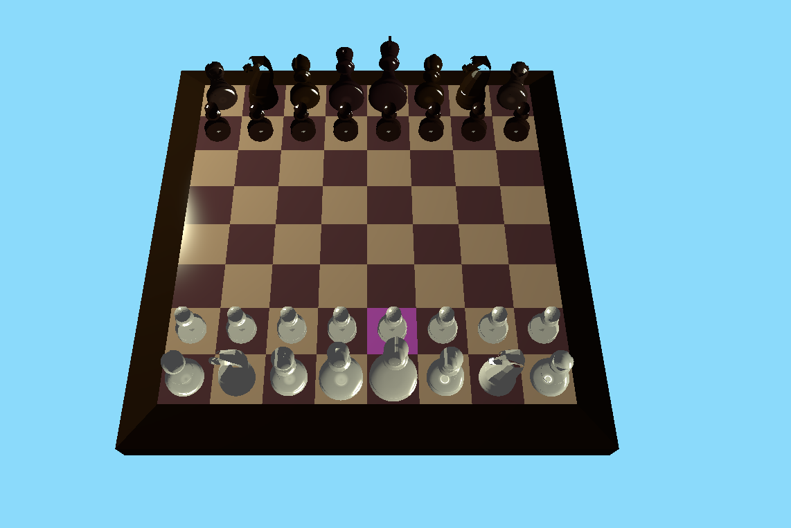

# 3D Chess
A 3D chess game in OpenGL created for the purposes of assessment for a computer graphics course.
Wavefront OBJ files aren't available in the repository and must be exported from the Blender source.

## Usage

## Requirements

## Game Control
|Key|Action|
|:---:|:---:|
|`W`|Move cursor forward|
|`A`|Move cursor left|
|`S`|Move cursor backward|
|`D`|Move cursor right|
|`Space`|Select piece Move piece Cancel move|